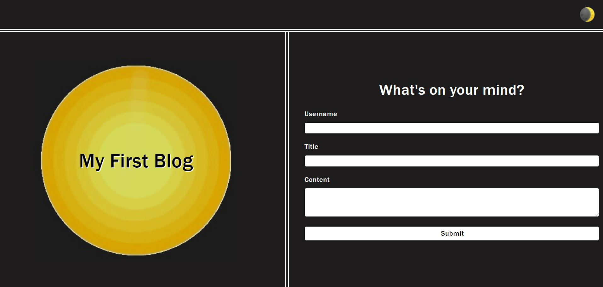
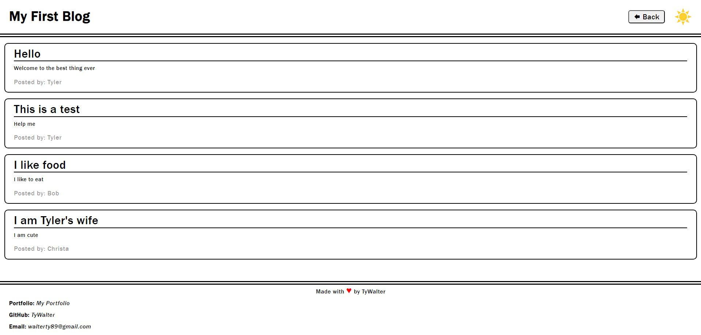

# Personal Blog
This is a homework assignment where I had to use express for routing and make a simple note taker page that updates a db.json with newly inputted data and can user express to display that data.

## Description
This note taker page is meant to jot down a note with a title and once submitted, displays it on the left sidebar where it can be viewed at any time. If you wish to delete a note, that is also possible and is done once you are viewing a note. You can also clear the entries of the form with a clear button if you don't wish to save the note.

## Visuals
*  
*  
*  
*  

Here are screenshots of the deployed application.

## Usage
This is intended to take simple notes and easily track/delete them from a webpage. This is also for grading purposes.

## Acknowledgments
Thank you to [express](https://www.npmjs.com/package/express) and [UUID](https://www.npmjs.com/package/uuid) for allowing me to use their packages.

## Support
If you have any issues with this repo, shoot me an email at walterty89@gmail.com. 