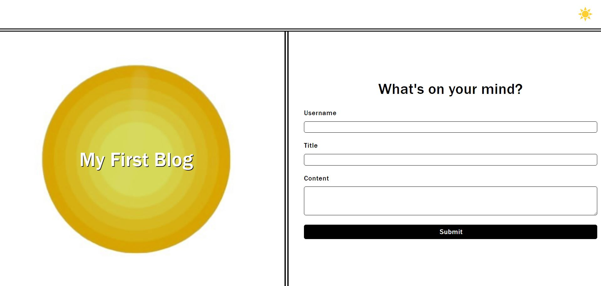

# Personal Blog
This is a homework assignment where I had to use local storage to enter blog information on a home page and display that information on a second page.

## Description
This application can be used to create new blogs and easily view them. To create a new blog, you just need to fill out all the input fields and once you hit submit, you'll be taken to a second page where you can view all past entries. There is also a toggleable light/dark mode on both pages that will remember the last chosen mode.

## Visuals
*  
*  
*  
*  

Here are screenshots of the deployed application.

## Usage
This is intended to enter blog posts on a landing page and display that information along with previous entries on a second page. This is also for grading purposes.

## Acknowledgments
Thank you to [Icons8](https://www.icons8.com) for allowing me to download and use svg icon images.

## Support
If you have any issues with this repo, shoot me an email at walterty89@gmail.com. 